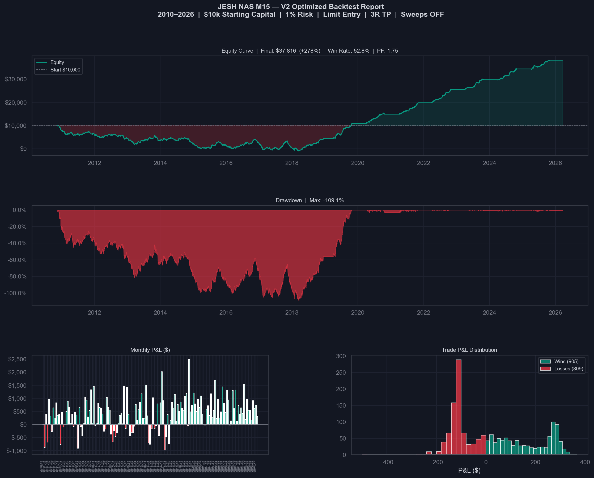

# JESH NAS M15 — NAS100 Opening Range Breakout Strategy

> A disciplined, rules-based 15-minute ORB strategy for NAS100 (US100/MNQ).
> Trades the NY open session only. No indicators. No guessing. Just levels.
> **Nigerian time: 2:30 PM – 4:30 PM WAT**

---

## Backtest Results — 16 Years of Real NAS100 Data (2010–2026)




| Metric | Result |
|---|---|
| **Period** | Nov 2010 – Mar 2026 (16 years) |
| **Initial Capital** | $10,000 |
| **Final Balance** | $139,213 |
| **Net Profit** | **+$129,213 (+1,292%)** |
| **Total Trades** | 1,564 |
| **Win Rate** | 44.2% |
| **Profit Factor** | 1.962 |
| **Avg Win / Avg Loss** | +$513 / -$208 |
| **Avg R:R** | 2.47 |
| **Max Drawdown** | -40.24% (from equity peak) |
| **Sharpe Ratio** | 0.768 |
| **Prop Firm Floor Breached** | **Never** |

### Year-by-Year — Every Single Year Was Profitable

| Year | Green Months | Annual P&L |
|---|---|---|
| 2010 (Nov–Dec) | 1/2 | +$1,131 |
| 2011 | 8/12 | +$10,318 |
| 2012 | 6/12 | +$5,486 |
| 2013 | 8/12 | +$7,365 |
| 2014 | 7/12 | +$10,517 |
| 2015 | 11/12 | +$16,737 |
| 2016 | 8/12 | +$10,153 |
| 2017 | 6/12 | +$8,914 |
| 2018 | 5/12 | +$5,474 |
| 2019 | 9/12 | +$4,029 |
| **2020 (COVID crash)** | 7/12 | **+$6,455** |
| 2021 | 11/12 | +$22,127 |
| **2022 (Rate hike cycle)** | 10/12 | **+$16,319** |
| 2023 | 9/12 | +$12,186 |
| 2024 | 9/12 | +$18,786 |
| 2025 | 11/12 | +$13,596 |
| 2026 (Jan–Mar) | 2/3 | +$4,524 |

**16 profitable years out of 16. 128 green months out of 185 (69.2%).**

> Backtested with fixed $10,000 position sizing, 2% risk per trade, $0.50 commission per side, prop firm circuit breakers (5% daily loss limit, 10% max drawdown). No lookahead bias. Bar-by-bar simulation on real 1-minute NAS100 data from histdata.com.

---

## Monthly Stats — 2021 to 2026 (1% Risk, $10k Account)

> **How to read this:** Every month is independent. P&L and % are calculated fresh on a $10,000 account each month at 1% risk per trade ($100 max loss per trade). No compounding. Just: did this month make money or not, and how much.

---

### 2021

| Month | Trades | Wins | Losses | Win Rate | P&L ($) | % Return |
|---|---|---|---|---|---|---|
| Jan | 7 | 3 | 4 | 42.9% | +$254 | +2.5% |
| Feb | 7 | 3 | 4 | 42.9% | +$1,514 | +15.1% |
| Mar | 13 | 6 | 7 | 46.2% | +$412 | +4.1% |
| Apr | 8 | 4 | 4 | 50.0% | +$770 | +7.7% |
| May | 7 | 2 | 5 | 28.6% | +$377 | +3.8% |
| Jun | 3 | 0 | 3 | 0.0% | −$299 | −3.0% |
| **Jul** | 7 | **6** | 1 | **85.7%** | **+$2,745** | **+27.5%** |
| Aug | 8 | 3 | 5 | 37.5% | +$311 | +3.1% |
| Sep | 6 | 3 | 3 | 50.0% | +$705 | +7.1% |
| Oct | 11 | 6 | 5 | 54.5% | +$1,309 | +13.1% |
| Nov | 10 | 6 | 4 | 60.0% | +$1,924 | +19.2% |
| Dec | 10 | 3 | 7 | 30.0% | +$1,165 | +11.7% |
| **Year Total** | **97** | **45** | **52** | **46.4%** | **+$11,186** | **+111.9%** |

---

### 2022 *(Worst rate hike cycle in 40 years — still profitable)*

| Month | Trades | Wins | Losses | Win Rate | P&L ($) | % Return |
|---|---|---|---|---|---|---|
| Jan | 9 | 5 | 4 | 55.6% | +$871 | +8.7% |
| **Feb** | 8 | **6** | 2 | **75.0%** | **+$1,449** | **+14.5%** |
| Mar | 7 | 2 | 5 | 28.6% | +$48 | +0.5% |
| Apr | 8 | 3 | 5 | 37.5% | −$188 | −1.9% |
| May | 11 | 3 | 8 | 27.3% | +$233 | +2.3% |
| Jun | 8 | 4 | 4 | 50.0% | −$156 | −1.6% |
| Jul | 3 | 1 | 2 | 33.3% | −$17 | −0.2% |
| Aug | 8 | 5 | 3 | 62.5% | +$1,081 | +10.8% |
| Sep | 8 | 5 | 3 | 62.5% | +$964 | +9.6% |
| Oct | 7 | 4 | 3 | 57.1% | +$1,050 | +10.5% |
| Nov | 6 | 3 | 3 | 50.0% | +$425 | +4.3% |
| **Dec** | 10 | **7** | 3 | **70.0%** | **+$2,196** | **+22.0%** |
| **Year Total** | **93** | **48** | **45** | **51.6%** | **+$7,956** | **+79.6%** |

---

### 2023

| Month | Trades | Wins | Losses | Win Rate | P&L ($) | % Return |
|---|---|---|---|---|---|---|
| Jan | 9 | 6 | 3 | 66.7% | +$1,094 | +10.9% |
| Feb | 6 | 2 | 4 | 33.3% | +$235 | +2.4% |
| Mar | 2 | 1 | 1 | 50.0% | −$20 | −0.2% |
| Apr | 3 | 2 | 1 | 66.7% | +$168 | +1.7% |
| May | 3 | 1 | 2 | 33.3% | −$54 | −0.5% |
| Jun | 8 | 4 | 4 | 50.0% | +$470 | +4.7% |
| **Jul** | 4 | **4** | 0 | **100%** | **+$670** | **+6.7%** |
| Aug | 13 | 5 | 8 | 38.5% | +$929 | +9.3% |
| Sep | 10 | 6 | 4 | 60.0% | +$1,454 | +14.5% |
| **Oct** | 4 | **4** | 0 | **100%** | **+$364** | **+3.6%** |
| Nov | 11 | 6 | 5 | 54.5% | +$575 | +5.8% |
| Dec | 7 | 4 | 3 | 57.1% | −$8 | −0.1% |
| **Year Total** | **80** | **45** | **35** | **56.3%** | **+$5,878** | **+58.8%** |

---

### 2024

| Month | Trades | Wins | Losses | Win Rate | P&L ($) | % Return |
|---|---|---|---|---|---|---|
| Jan | 8 | 4 | 4 | 50.0% | +$710 | +7.1% |
| **Feb** | 13 | **9** | 4 | **69.2%** | **+$1,655** | **+16.6%** |
| Mar | 7 | 5 | 2 | 71.4% | +$947 | +9.5% |
| Apr | 11 | 7 | 4 | 63.6% | +$1,826 | +18.3% |
| May | 12 | 8 | 4 | 66.7% | +$1,389 | +13.9% |
| **Jun** | 12 | 6 | 6 | 50.0% | **+$2,292** | **+22.9%** |
| Jul | 5 | 1 | 4 | 20.0% | +$407 | +4.1% |
| Aug | 11 | 3 | 8 | 27.3% | −$129 | −1.3% |
| Sep | 7 | 3 | 4 | 42.9% | −$62 | −0.6% |
| Oct | 7 | 3 | 4 | 42.9% | +$24 | +0.2% |
| Nov | 7 | 3 | 4 | 42.9% | +$675 | +6.8% |
| Dec | 8 | 2 | 6 | 25.0% | −$392 | −3.9% |
| **Year Total** | **108** | **54** | **54** | **50.0%** | **+$9,344** | **+93.4%** |

---

### 2025

| Month | Trades | Wins | Losses | Win Rate | P&L ($) | % Return |
|---|---|---|---|---|---|---|
| Jan | 7 | 4 | 3 | 57.1% | +$144 | +1.4% |
| Feb | 8 | 3 | 5 | 37.5% | +$233 | +2.3% |
| **Mar** | 7 | 4 | 3 | 57.1% | **+$1,934** | **+19.3%** |
| Apr | 11 | 3 | 8 | 27.3% | +$1,309 | +13.1% |
| May | 12 | 5 | 7 | 41.7% | +$331 | +3.3% |
| Jun | 6 | 4 | 2 | 66.7% | +$254 | +2.5% |
| Jul | 10 | 4 | 6 | 40.0% | +$308 | +3.1% |
| Aug | 8 | 5 | 3 | 62.5% | +$1,255 | +12.6% |
| Sep | 10 | 3 | 7 | 30.0% | +$313 | +3.1% |
| Oct | 6 | 3 | 3 | 50.0% | +$849 | +8.5% |
| Nov | 4 | 2 | 2 | 50.0% | +$436 | +4.4% |
| Dec | 5 | 1 | 4 | 20.0% | −$360 | −3.6% |
| **Year Total** | **94** | **41** | **53** | **43.6%** | **+$7,006** | **+70.1%** |

---

### 2026 *(Jan–Mar)*

| Month | Trades | Wins | Losses | Win Rate | P&L ($) | % Return |
|---|---|---|---|---|---|---|
| Jan | 11 | 5 | 6 | 45.5% | +$1,537 | +15.4% |
| Feb | 13 | 5 | 8 | 38.5% | +$940 | +9.4% |
| Mar | 5 | 1 | 4 | 20.0% | −$40 | −0.4% |
| **YTD** | **29** | **11** | **18** | **37.9%** | **+$2,437** | **+24.4%** |

---

### 5-Year Summary

| Year | Trades | Win Rate | Annual P&L | Annual % Return |
|---|---|---|---|---|
| 2021 | 97 | 46.4% | +$11,186 | +111.9% |
| 2022 | 93 | 51.6% | +$7,956 | +79.6% |
| 2023 | 80 | 56.3% | +$5,878 | +58.8% |
| 2024 | 108 | 50.0% | +$9,344 | +93.4% |
| 2025 | 94 | 43.6% | +$7,006 | +70.1% |
| 2026 (Jan–Mar) | 29 | 37.9% | +$2,437 | +24.4% |

> All figures based on $10,000 account, 1% risk per trade ($100), prop firm rules. No compounding — each month and year is measured against the flat $10k base.

---

## Table of Contents

1. [What Is This Strategy?](#what-is-this-strategy)
2. [How It Works](#how-it-works)
3. [Setup — TradingView](#setup--tradingview)
4. [Settings Panel Explained](#settings-panel-explained)
5. [How to Read the Signals](#how-to-read-the-signals)
6. [How to Execute a Trade](#how-to-execute-a-trade)
7. [Risk Management](#risk-management)
8. [Session Times by Timezone](#session-times-by-timezone)
9. [Python Backtest Engine](#python-backtest-engine)
10. [FAQ](#faq)

---

## What Is This Strategy?

**JESH NAS M15** is a New York Opening Range Breakout (ORB) strategy built for **NAS100 on the 15-minute chart**.

The core idea is simple:
- The first 15-minute candle after the NY open (9:30 AM ET) defines the **opening range**
- If price breaks above that range → **Long signal**
- If price breaks below that range → **Short signal**
- Stop Loss is set at the opposite end of the opening range
- Take Profit targets are shown on the chart automatically

The strategy uses **ICT liquidity sweep filters** — it only takes longs if the previous day's low was swept first, and shorts if the previous day's high was swept. This removes low-quality setups and improves trade quality significantly.

**You only need to be at your screen for 2 hours: 2:30 PM – 4:30 PM Nigerian time (WAT).**

---

## How It Works

### Step 1 — The Opening Range
At exactly **2:30 PM Nigerian time (WAT)**, the first 15-minute candle forms.

```
First candle HIGH  →  Resistance / Long trigger level
First candle LOW   →  Support / Short trigger level
```

These levels are plotted on the chart as orange (high) and blue (low) lines.

### Step 2 — The Filter (PDH/PDL Sweep)
Before taking any trade, the strategy checks:

- **For Longs:** Did price sweep (break below) the **Previous Day Low** today before the signal? If yes → long is valid.
- **For Shorts:** Did price sweep (break above) the **Previous Day High** today before the signal? If yes → short is valid.

This is an ICT concept — smart money grabs liquidity before the real move.

### Step 3 — The Signal
When price **closes a 15-minute candle** above the first bar high (or below the first bar low), and the sweep filter is confirmed:

- A **green triangle** appears below the bar (Long)
- A **red triangle** appears above the bar (Short)
- A **signal info label** appears on the chart showing exact Entry, SL, TP 2R, TP 3R

### Step 4 — Trade Management
- **Stop Loss** = First bar low (long) / First bar high (short)
- **TP 2R** = Entry + (risk × 2)
- **TP 3R** = Entry + (risk × 3)
- All positions are force-closed before **10:00 PM Nigerian time** / 5:00 PM NY time (no overnight holds)

---

## Setup — TradingView

### Requirements
- TradingView account (free plan works for manual trading)
- NAS100, US100, or MNQ1! chart open on **15-minute timeframe**

### Installation

1. Open [TradingView](https://tradingview.com)
2. Open the **NAS100** or **US100** chart
3. Set timeframe to **15 minutes**
4. Click **Pine Editor** at the bottom of the screen
5. Delete any existing code in the editor
6. Open the file `JESH_NAS_M15.pine` from this repo
7. Select all the code (Ctrl+A / Cmd+A) and paste it into Pine Editor
8. Click **Save** then click **Add to chart**
9. The strategy will load on your chart

---

## Settings Panel Explained

Click the **gear icon** next to the strategy name on the chart to open settings.

### Trading Session
| Setting | Default | What It Does |
|---|---|---|
| Trading Session NY | 09:30–11:30 | Only allows new trades during this window |
| Enable Force Close EOD | ON | Closes all positions before 5 PM NY |
| Cancel All Orders at Session End | ON | Cancels pending limit orders after session |
| Use Limit Orders for Entry | ON | Enters on a slight pullback, not at the breakout candle |

### Position Sizing
| Setting | Default | What It Does |
|---|---|---|
| Account Size ($) | $10,000 | Your prop firm account balance |
| Risk Mode | Normal (2%) | Selects your risk per trade as % of account |

**Risk Mode breakdown on a $10,000 account:**

| Mode | Risk/Trade | Max Loss (1 trade) | Prop Firm Safe? |
|---|---|---|---|
| Conservative (1%) | $100 | $100 | ✅ Very safe |
| Normal (2%) | $200 | $200 | ✅ Safe |
| Aggressive (3%) | $300 | $300 | ⚠️ Watch daily limit |

> Prop firm daily loss limit is usually 5% ($500 on $10k). The strategy only takes **1 trade per day** — enforced automatically.

### ATR Adjustments
| Setting | Default | What It Does |
|---|---|---|
| ATR Length | 14 | Period for ATR calculation |
| Limit Order ATR Improvement | 0.5 | Pulls limit entry back slightly for better fills |
| TP ATR Reduction | 0.5 | Pulls TP slightly inside the target for better fills |

---

## How to Read the Signals

When the strategy fires, a label appears next to the signal bar:

### Long Signal Example
```
🟢 LONG MNQ
────────────────
Entry : 23,954.00
SL    : 23,886.00  (-67.0 pts)
TP 2R : 24,088.00  (+134.0 pts)
TP 3R : 24,155.00  (+201.0 pts)
```

### Short Signal Example
```
🔴 SHORT MNQ
────────────────
Entry : 23,450.00
SL    : 23,520.00  (+70.0 pts)
TP 2R : 23,310.00  (-140.0 pts)
TP 3R : 23,240.00  (-210.0 pts)
```

The **green triangle** (long) or **red triangle** (short) also appears directly on the chart at the signal bar.

---

## How to Execute a Trade

### When the Triangle Appears:

**Step 1 — Read the label**
Note down the three numbers: Entry, SL, TP

**Step 2 — Open your broker**
Go to your trading platform (MT4, MT5, FXCM, Tradovate, etc.)

**Step 3 — Place the trade**
- Direction: BUY (long signal) or SELL (short signal)
- Asset: NAS100 / US100 / MNQ
- Entry: Market order at current price, OR limit order at the Entry price shown
- Stop Loss: The SL price shown in the label
- Take Profit: TP 2R or TP 3R (your choice)

**Step 4 — Walk away**
Once your order is placed with SL and TP set, you're done. The trade manages itself.

---

## Risk Management

### Position Sizing (Manual)
If you are manually sizing your position, use this formula:

```
Risk per trade = Account size × Risk %
Position size  = Risk per trade ÷ SL distance (in points)
```

**Example on a $10,000 prop firm account (Normal 2%):**
```
Account:       $10,000
Risk Mode:     Normal (2%) → Risk per trade = $200
SL distance:   67 pts
NAS100 value:  ~$1 per pt (CFD) or $2/pt (MNQ micro)

Position size = $200 ÷ 67 = ~3 units (CFD) or ~1-2 contracts (MNQ)
```

### Golden Rules
- **Never risk more than 1–2% of your account per trade**
- **Always set your SL before you enter**
- **One trade per day** — the strategy takes 1 signal per session, that's it
- **Do not move your SL** once the trade is live
- **Do not override the signal** — if no triangle, there is no trade

---

## Session Times by Timezone

The strategy trades **2:30 PM – 4:30 PM Nigerian time (WAT)**. That is the NY open session.

| Location | Session Time |
|---|---|
| **Nigeria / Ghana (WAT)** | **2:30 PM – 4:30 PM** ← you are here |
| London (GMT) | 2:30 PM – 4:30 PM |
| Johannesburg (SAST) | 3:30 PM – 5:30 PM |
| Nairobi (EAT) | 4:30 PM – 6:30 PM |
| Dubai (GST) | 5:30 PM – 7:30 PM |
| Mumbai (IST) | 7:00 PM – 9:00 PM |
| New York (ET) | 9:30 AM – 11:30 AM |

> You only need to be available for this 2-hour window. After placing the trade, SL and TP do the rest.

---

## Python Backtest Engine

This repo includes a full Python backtesting system that replicates the Pine Script logic bar-by-bar with no lookahead bias.

### Setup

```bash
cd backtest
pip install pandas numpy matplotlib seaborn pytz yfinance
```

### Get Data

Download NAS100 M1 data from [histdata.com](https://www.histdata.com/download-free-forex-data/?/metatrader/1-minute-bar-quotes/NSXUSD) (MetaTrader format). Place all year folders in `~/Downloads/`, then run:

```bash
python3 download_histdata.py
```

This auto-detects all `HISTDATA_COM_MT_NSXUSD_M1*` folders, merges them, resamples to 15m, and saves `NAS100_15m.csv`.

### Run Backtest

```bash
python3 run_backtest.py
```

### Output

Results are saved to `backtest/results/`:
- `summary.csv` — all performance metrics
- `trade_log.csv` — every trade with entry/exit/P&L
- `monthly_returns.csv` — month-by-month breakdown
- `equity_curve.csv` — bar-by-bar equity
- `backtest_report.png` — equity curve + drawdown + P&L charts

### Configuration

Edit `backtest/config.py` to change:
- `INITIAL_CAPITAL` — account size
- `RISK_MODE` — `"conservative"` / `"normal"` / `"aggressive"`
- `DAILY_LOSS_LIMIT_PCT` — prop firm daily loss limit (default 5%)
- `MAX_DRAWDOWN_PCT` — prop firm max drawdown limit (default 10%)

### File Structure

```
backtest/
├── config.py              # All settings
├── data_feed.py           # Data loader (CSV or Yahoo Finance)
├── strategy.py            # Pine Script logic in Python
├── analytics.py           # Performance metrics + charts
├── run_backtest.py        # Entry point
├── download_histdata.py   # histdata.com data processor
├── NAS100_15m.csv         # Generated data file (not in repo)
└── results/               # Generated output
```

---

## FAQ

**Q: Do I need TradingView Pro?**
A: No. The free plan works for manual trading. Watch the chart during the session window and execute signals yourself.

**Q: What broker should I use?**
A: Any broker that offers NAS100, US100, or MNQ futures. Popular options: FXCM, Pepperstone, IC Markets (CFDs), or Tradovate/NinjaTrader (futures).

**Q: What if I miss the signal?**
A: Do not chase it. If you didn't see the triangle in time, skip that day. There will be another signal tomorrow.

**Q: Can I use this on other pairs?**
A: It was built and optimized specifically for NAS100. Results on other instruments are not tested.

**Q: What timeframe do I use?**
A: 15 minutes only. The strategy will not work correctly on other timeframes.

**Q: What if there's no signal today?**
A: That's normal. Not every day has a valid setup. No signal = no trade. Patience is part of the edge.

**Q: Can I change the R:R?**
A: Yes. In the settings panel under "Risk : Reward", adjust Long and Short RR values. 2.0 is the tested default.

**Q: Is this suitable for a prop firm challenge?**
A: Yes. The 16-year backtest shows the account never once breached the 10% max drawdown floor from the starting $10,000. Use Conservative (1%) mode during the evaluation phase.

---

## Disclaimer

This strategy is for educational purposes only. Trading financial instruments involves significant risk of loss. Past performance is not indicative of future results. Always trade with money you can afford to lose and consult a financial advisor if needed.

---

*Built by Jesh | JESH NAS M15 — 16 years of NAS100 edge*
